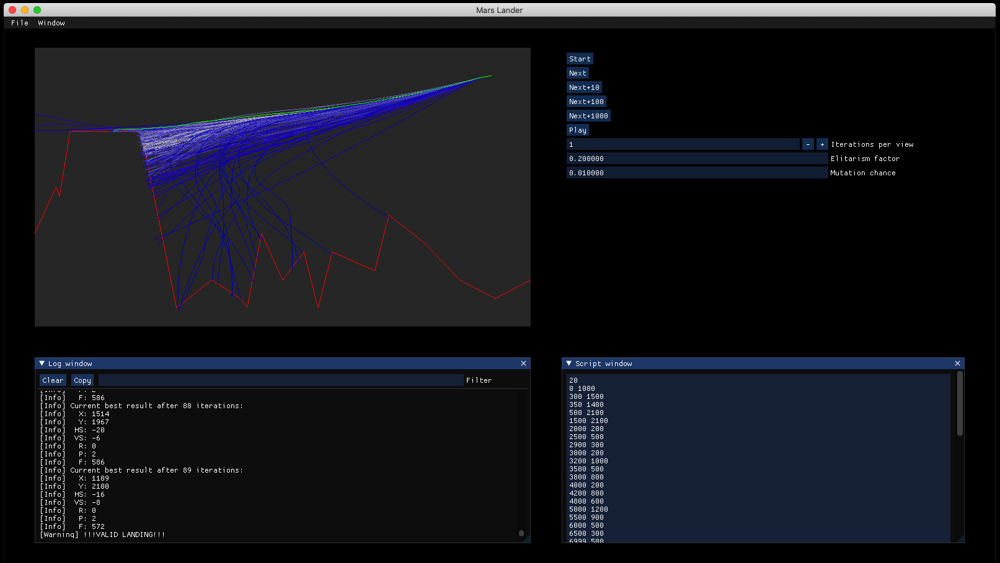

# MarsLander
Tool for solving the Mars Lander puzzle game from [Coding Games](https://www.codingame.com/ide/puzzle/mars-lander) with genetic algorithms, based on [this](https://www.codingame.com/blog/genetic-algorithm-mars-lander/) blog post.

Building
--------
First of all, MarsLander uses submodules, so don't forget to also call

     git submodule update --init

Next, run CMake to generate a solution file on Windows, a make file on Linux, or an XCode project on MacOs.
You can build MarsLander without downloading other external projects (as all necessary dependencies are delivered with the code).

Screenshot
----------

What is it exactly?
-------------------
See [this](https://www.codingame.com/blog/genetic-algorithm-mars-lander/) blog post.
